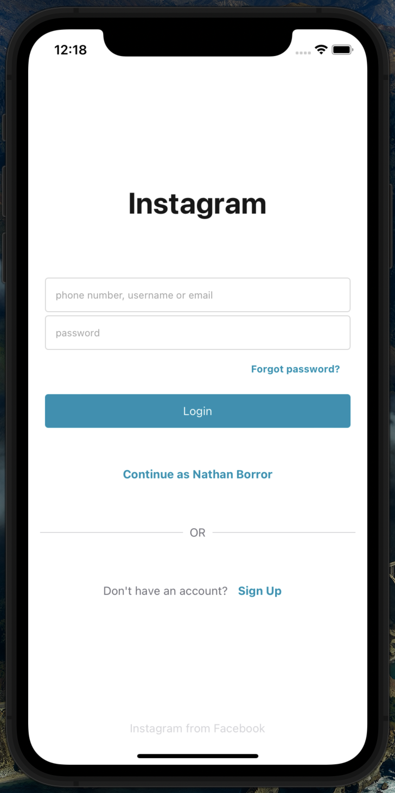
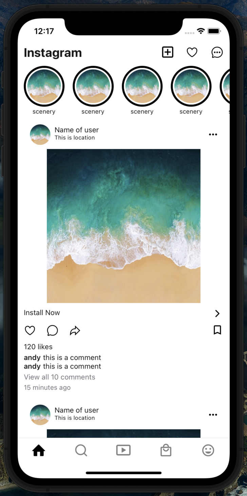
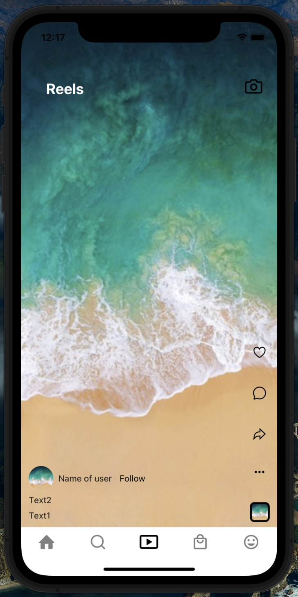
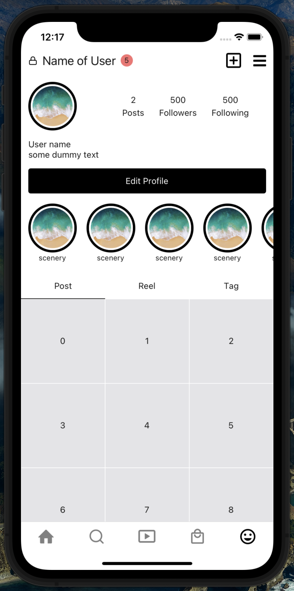

# React native instagram app clone project

[](LICENSE)


## App preview
<div style='display: flex; '>




</div>


<br></br>

## Installation

Install [nodeJS](https://nodejs.org/en/download) to your machine and check version to confirm installation
```
node -v
```


Install Yarn through the npm package manager 

```
npm install --global yarn
```

```
yarn install
```
### Executing program

```
yarn start
```

If you want to `expo start`, install the expo cli in global package manager
```
npm install -g expo-cl
```

## Root directory 
```
ig_project
├── App.tsx
├── LICENSE
├── README.md
├── app.json
├── assets
│   ├── adaptive-icon.png
│   ├── favicon.png
│   ├── icon.png
│   ├── icons
│   │   └── icons.ts
│   ├── images
│   │   ├── images.ts
│   │   └── sample.jpg
│   └── splash.png
├── babel.config.js
├── package.json
├── screenshot
│   ├── home.png
│   ├── login.png
│   ├── profile.png
│   └── reel.png
├── src
│   ├── components
│   │   ├── IconHorizontalScrollView.tsx
│   │   ├── IconNameHorizontal.tsx
│   │   ├── MyTabBar.tsx
│   │   ├── Post.tsx
│   │   ├── ReelComponent.tsx
│   │   ├── SearchItem.tsx
│   │   ├── TopSelfUserBar.tsx
│   │   ├── UserProfile.tsx
│   │   └── button
│   │       ├── LikeButton.tsx
│   │       └── MyButton.tsx
│   ├── configs
│   ├── hooks
│   │   ├── useMyTabStore.tsx
│   │   ├── useNavBarStyleStore.ts
│   │   └── useNumberofPostStore.ts
│   ├── routes
│   │   ├── ProfileTab.tsx
│   │   ├── RootStackParamList .ts
│   │   └── Routes.tsx
│   ├── screens
│   │   ├── Discover.tsx
│   │   ├── Home.tsx
│   │   ├── Login.tsx
│   │   ├── Profile
│   │   │   ├── PersonalPosts.tsx
│   │   │   ├── PersonalReels.tsx
│   │   │   ├── PersonalTags.tsx
│   │   │   ├── Profile.tsx
│   │   │   ├── ProfileHeader.tsx
│   │   │   └── mocks
│   │   │       ├── PostGrid.tsx
│   │   │       └── PostGridExample.tsx
│   │   ├── Reels.tsx
│   │   ├── Shop.tsx
│   │   └── Test
│   │       └── example.tsx
│   ├── styles
│   │   └── constants.ts
│   └── theme
│       └── theme.ts
├── tsconfig.json
└── yarn.lock
```
## License

All the code available under the MIT. See [LICENSE](LICENSE).
